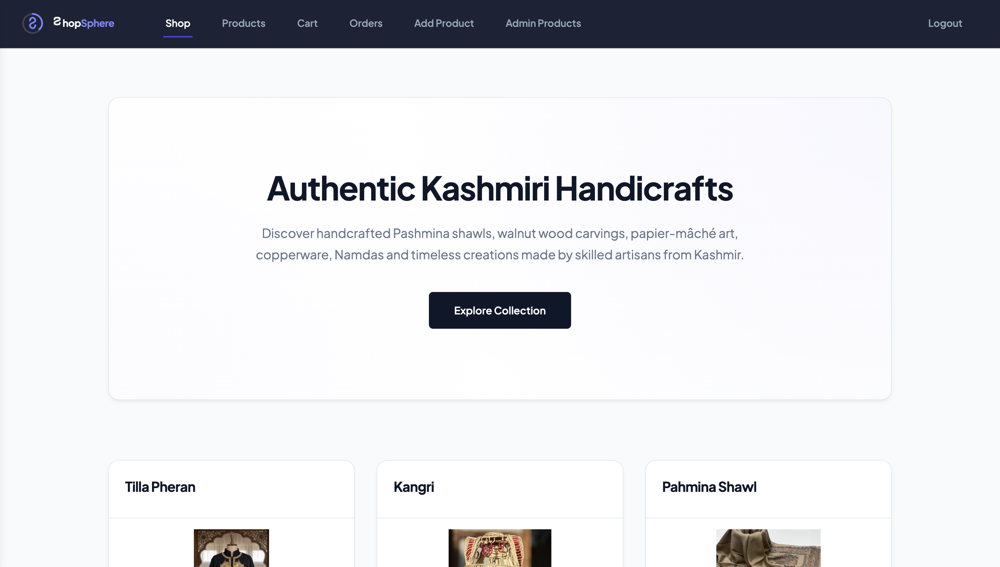
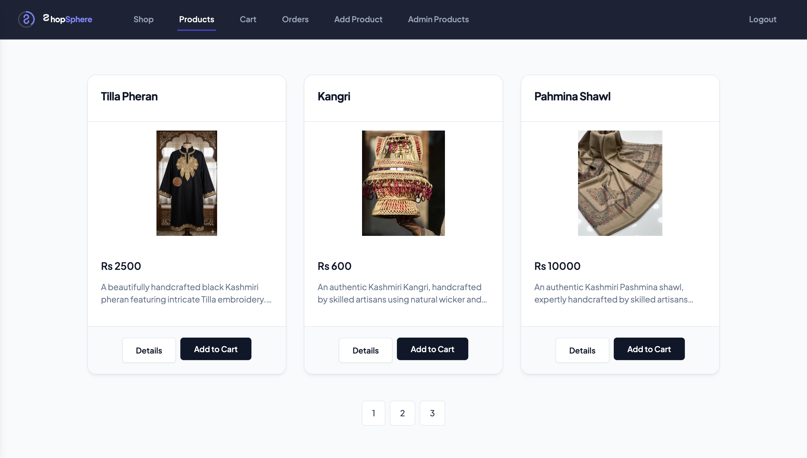
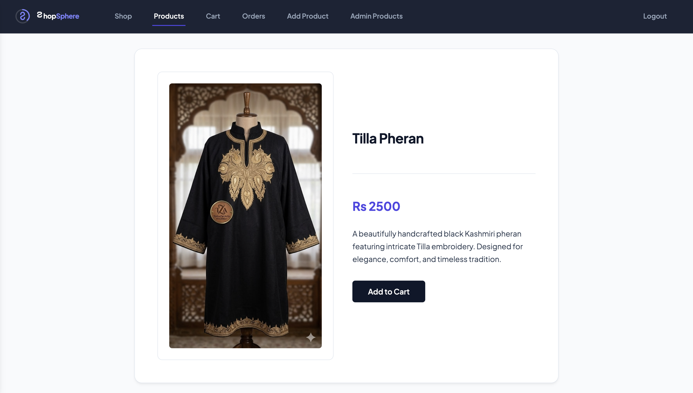
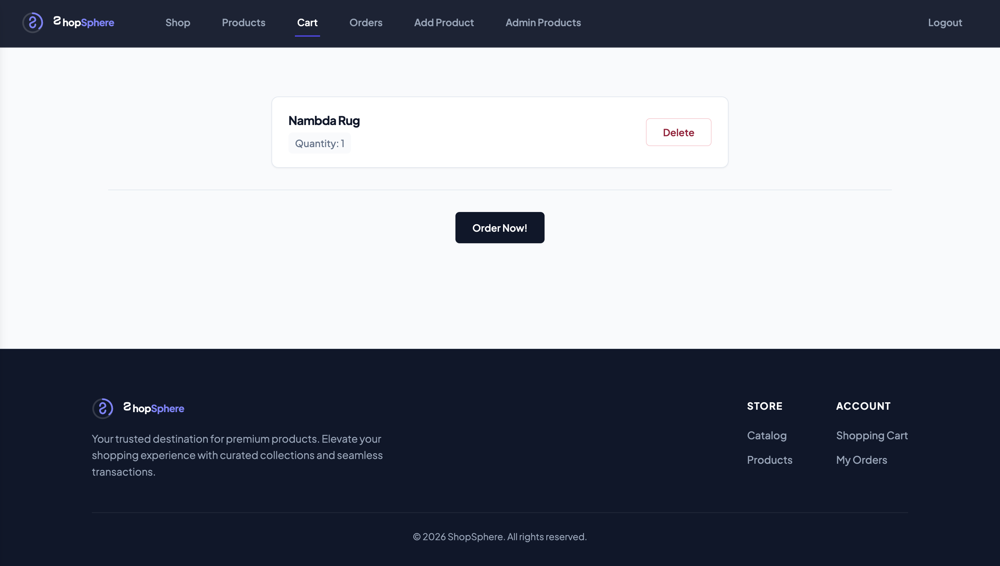
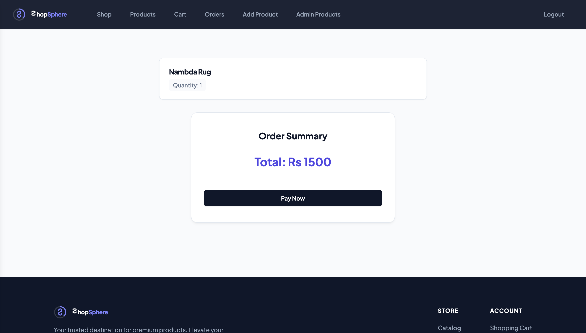
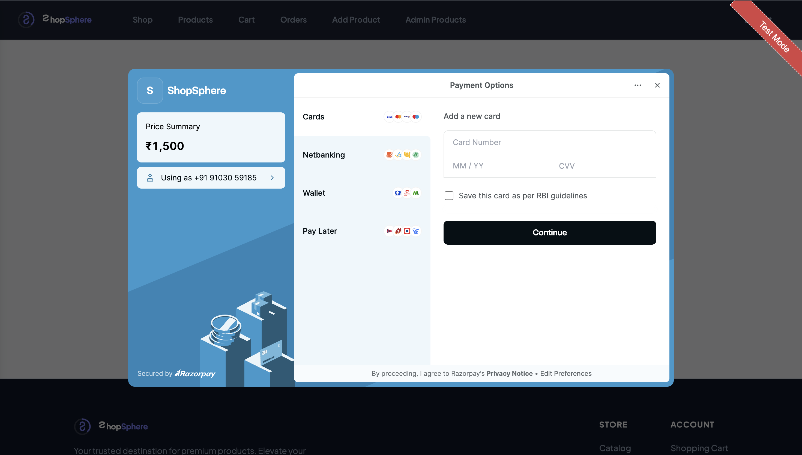
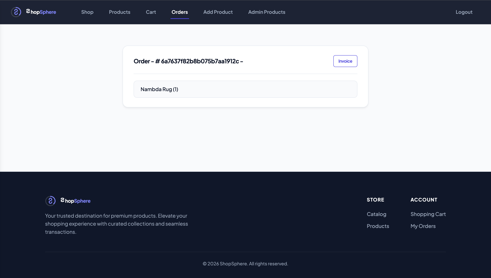
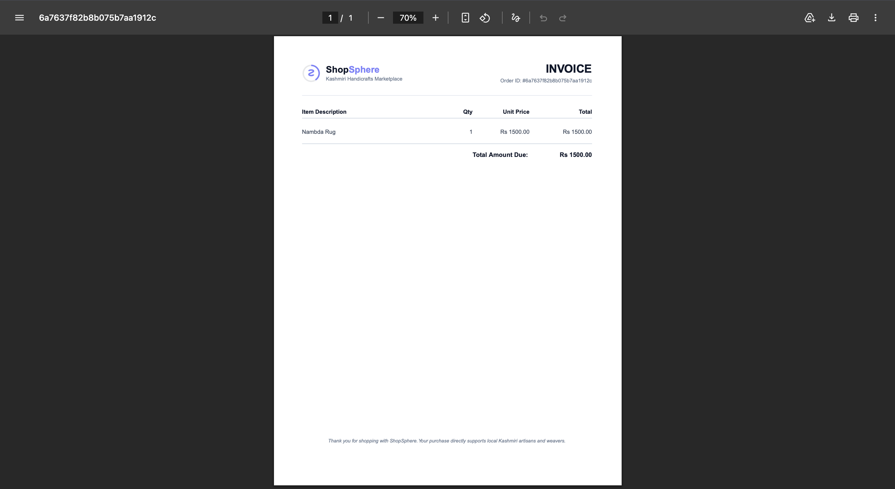
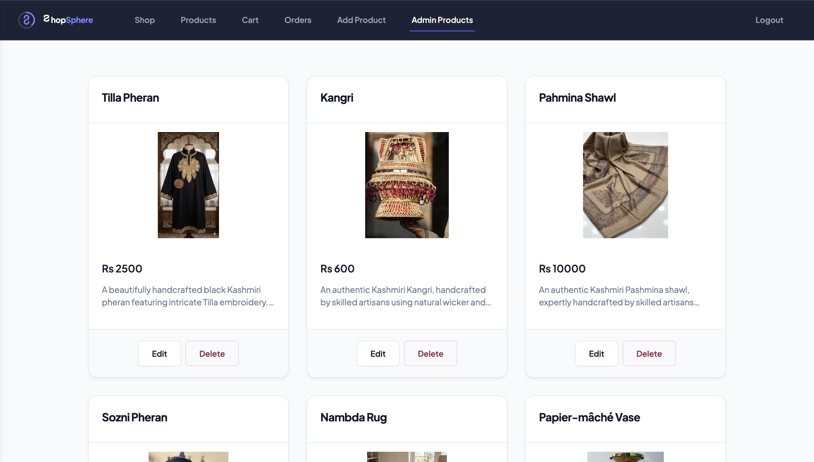

# ShopSphere

ShopSphere is a full-stack server-side rendered e-commerce web application for authentic Kashmiri handicrafts, built with Node.js, Express, MongoDB, and EJS.

## Live Demo
[Live Application](https://shopsphere-d391.onrender.com/)

## Features

- Session-based user authentication and signup.
- Password reset flow via email.
- Admin dashboard with product CRUD.
- Product image uploads using Multer.
- Server-side pagination for product listings.
- Shopping cart with database persistence.
- Checkout process integrated with Razorpay payments.
- PDF invoice generation using PDFKit.
- Gzip response compression.
- CSRF protection and HTTP header hardening.

## Tech Stack

### Frontend
- HTML5
- CSS3 (Vanilla CSS)
- JavaScript (Vanilla JS)
- EJS (Embedded JavaScript Templates)

### Backend
- Node.js
- Express.js
- Multer (File uploads)
- PDFKit (PDF generation)

### Database
- MongoDB Atlas
- Mongoose (Object Document Mapper - ODM)
- connect-mongodb-session (Session store)

### Security
- bcrypt (Password hashing)
- csurf (CSRF protection)
- helmet (HTTP headers)
- express-session (Session management)
- express-validator (Input validation)

### Payments
- Razorpay Node SDK

### Email
- SendGrid Mail API / Nodemailer

### Deployment
- Render Web Services

### Other Tools
- dotenv (Environment variables)
- morgan (Request logger)
- compression (Response compression)

## Architecture

```text
Browser
   │
   ▼
Express.js
   │
   ├── Middleware (Helmet, Compression, Morgan)
   ├── Body Parser & Multer
   ├── Sessions & CSRF
   ▼
Controllers (Route Handlers)
   │
   ├── Models (Mongoose ODM) ──► MongoDB Atlas
   │
   ▼
EJS Views
   │
   ▼
Browser (HTML Response)
```

## Project Structure

```text
ShopSphere/
├── controllers/          # Business logic handlers
│   ├── admin.js          # Admin product CRUD handlers
│   ├── auth.js           # Login, signup, and password reset handlers
│   └── shop.js           # Cart, checkout, order, and invoice PDF handlers
├── models/               # Mongoose schema definitions
│   ├── order.js          # Order schema storing transaction items
│   ├── product.js        # Product catalog schema
│   └── user.js           # User schema containing cart structures
├── routes/               # Express routing endpoints
│   ├── admin.js          # Admin routes
│   ├── auth.js           # Authentication routes
│   └── shop.js           # Customer shop and checkout routes
├── views/                # EJS template layouts
│   ├── admin/            # Dashboard and product form layouts
│   ├── auth/             # Onboarding and verification form layouts
│   ├── includes/         # Shared navigation, headers, and footers
│   └── shop/             # Catalog listings, cart, and orders layouts
├── public/               # Static client assets
│   ├── css/              # Application style sheets
│   ├── images/           # Brand vector SVGs and assets
│   └── js/               # Client-side input handlers and previews
├── data/                 # Server storage folders for dynamic PDFs
├── app.js                # App entrypoint and middleware pipeline
├── package.json          # Dependency manifest file
└── .env                  # Configuration variables (ignored)
```

## Installation

Make sure you have Node.js and MongoDB installed locally.

1. Clone the repository:
   ```bash
   git clone https://github.com/mirmadiha/nodeJS.git
   cd nodeJS
   ```

2. Install dependencies:
   ```bash
   npm install
   ```

3. Create a `.env` file in the root folder of the project.

## Environment Variables

Configure the following variables in your `.env` file:

```env
MONGODB_URI=
SESSION_SECRET=
PORT=
BASE_URL=
SENDGRID_API_KEY=
EMAIL_FROM=
RAZORPAY_KEY_ID=
RAZORPAY_KEY_SECRET=
```

## Running Locally

1. Start the server in development mode (with Nodemon):
   ```bash
   npm run dev
   ```

2. Start the server in production mode:
   ```bash
   npm start
   ```

## Deployment

To deploy the application on Render:

1. Create a new Web Service and link the GitHub repository.
2. Configure the build command:
   ```bash
   npm install
   ```
3. Configure the start command:
   ```bash
   npm start
   ```
4. Define the required environment variables in the environment settings tab:
   - `MONGODB_URI`
   - `SESSION_SECRET`
   - `PORT`
   - `BASE_URL`
   - `SENDGRID_API_KEY`
   - `EMAIL_FROM`
   - `RAZORPAY_KEY_ID`
   - `RAZORPAY_KEY_SECRET`

## Screenshots

### Home Page


### Products


### Product Details


### Shopping Cart


### Checkout and Payment



### Orders


### PDF Invoice


### Admin Dashboard


### Add Product Form


## Security

- **Helmet**: Adds security-related HTTP headers.
- **CSRF Protection**: Prevents Cross-Site Request Forgery attacks using CSRF tokens.
- **Password Hashing**: Hashes user passwords using bcrypt before storing them.
- **Express Sessions**: Stores user sessions securely in MongoDB.
- **Input Validation**: Validates and sanitizes user input using express-validator.
- **Environment Variables**: Keeps sensitive credentials outside the source code.

## Future Improvements

- Cloudinary integration for cloud-based storage of product images.
- Product reviews and ratings system.
- Search bar and filtering options on the catalog page.
- Email notifications for order placements.
- Improved mobile responsiveness on administrative panels.

## License

This project is licensed under the ISC License. See the `package.json` file for details.
